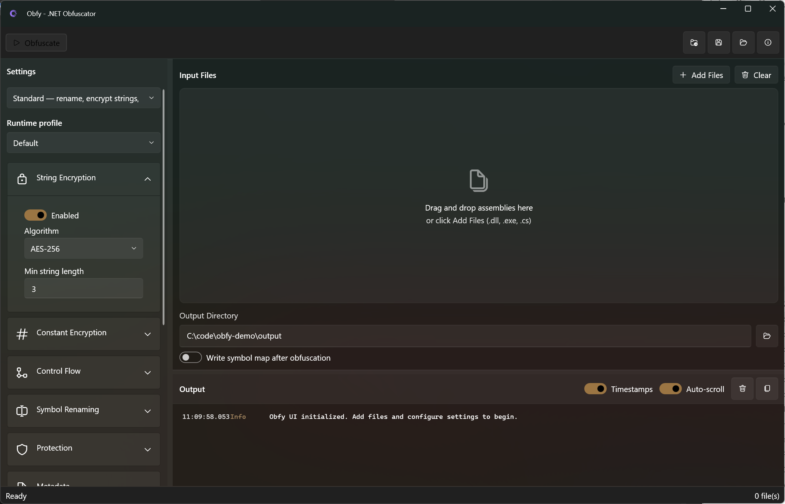
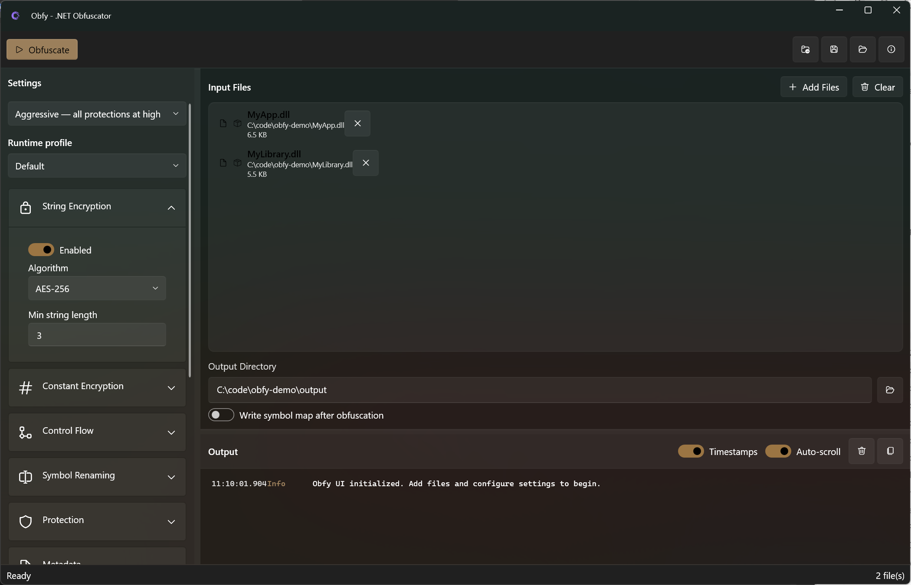
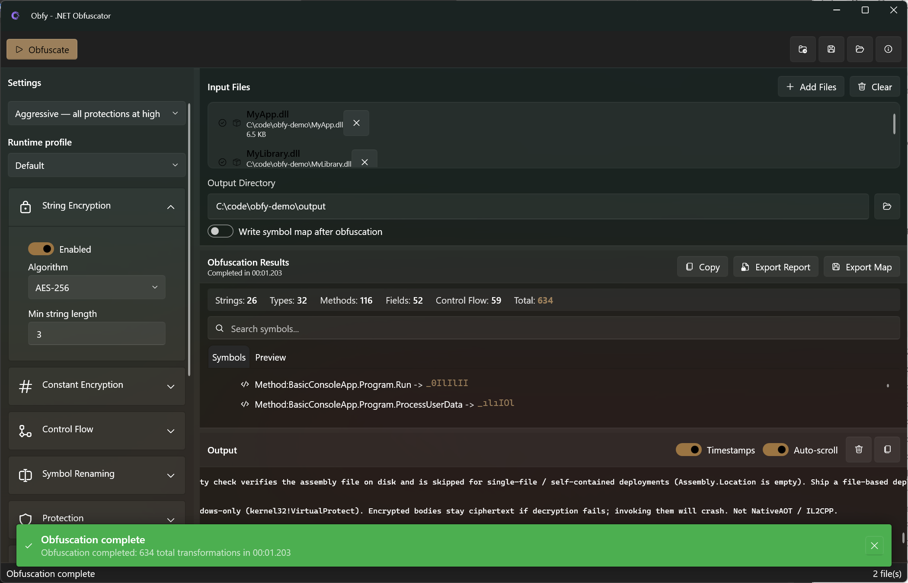

# Obfy

[](https://www.nuget.org/packages/Obfy/)
[](https://www.nuget.org/packages/Obfy/)
[](LICENSE)
[](https://dotnet.microsoft.com/)
[](https://github.com/mortenbrudvik/Obfy/actions/workflows/ci.yml)

**Professional .NET obfuscation tool for protecting C# assemblies and source code.**

Obfy helps protect your .NET applications from reverse engineering by applying multiple obfuscation techniques including string encryption, control flow obfuscation, symbol renaming, anti-debugging, anti-tamper, and metadata removal.

These techniques raise the cost of casual reverse engineering. They are **not** confidentiality: decryption keys live in the output assembly. Do not ship real secrets (API keys, tokens, credentials) inside an assembly and rely on obfuscation.



## Why Obfy?

- **Easy to Use** - Single command to obfuscate your assemblies
- **Configurable** - From minimal to aggressive protection levels, plus an interactive `config wizard`
- **Modern** - Built for .NET 10; CLI runs cross-platform, WPF UI is Windows
- **Extensible** - JSON configuration for fine-grained control
- **IDE Integration** - Visual Studio 2022 and JetBrains Rider extensions with right-click obfuscation
- **Fast** - Efficient obfuscation with minimal overhead

## Installation

### .NET tool (CLI, CI, Linux/macOS)

Requires the .NET 10 SDK or runtime.

```bash
dotnet tool install --global Obfy
```

Per-repo (commit `.config/dotnet-tools.json` so CI can `dotnet tool restore`):

```bash
dotnet new tool-manifest
dotnet tool install Obfy
```

If both the Windows installer/MSIX and the global tool are installed, both register the `obfy` command. Use one or the other on PATH.

### Windows installer / MSIX

Download and run the Obfy installer, which adds the `obfy` command to your PATH and installs the WPF UI.

You can also build a sideload/Store MSIX locally (this is not a Store listing yet):

```powershell
.\build\build-msix.ps1
```

See `package/README.md` for sideload, certificate trust, and Partner Center identity steps.

## Quick Start

### Command Line

```bash
# Basic obfuscation with standard protection
obfy MyApp.dll -o output/

# Aggressive protection for maximum security
obfy MyApp.dll -l aggressive -o output/

# Using a configuration file
obfy MyApp.dll -c obfy.json -o output/

# Generate a configuration file
obfy config generate -o obfy.json

# Generate an obfuscation report
obfy MyApp.dll -o output/ --report report.html

# Interactive configuration wizard
obfy config wizard -o obfy.json
```

### Desktop Application

Obfy also includes a modern WPF desktop application with Fluent Design:

```bash
# Run the UI
dotnet run --project Src/Obfy.UI/Obfy.UI.csproj

# Open with files already loaded
dotnet run --project Src/Obfy.UI/Obfy.UI.csproj -- MyApp.dll -o output/
```



**Features:**
- Three-panel layout (Settings, Files, Output)
- Drag-and-drop file support
- Level presets with expandable advanced settings
- Real-time progress and color-coded output
- Results visualization with symbol map export



### Visual Studio Extension

For Visual Studio 2022 users, Obfy provides seamless IDE integration:

**Features:**
- Right-click project → **Obfuscate** to protect your output assembly
- Toggle **Post-Build Obfuscation** for automatic protection on each build
- **Obfy Settings** dialog with level presets (Minimal/Standard/Aggressive)
- Per-project configuration stored in `obfy.json`
- Output window integration for real-time progress
- Tools → Options → Obfy for global defaults

### JetBrains Rider Extension

For JetBrains Rider users, Obfy provides seamless IDE integration:

**Features:**
- Right-click project → **Obfy** → **Obfuscate** to protect your output assembly
- Toggle **Post-Build Obfuscation** for automatic protection on each build
- **Settings** dialog with level presets (Minimal/Standard/Aggressive/Custom)
- Per-project configuration stored in `obfy.json`
- Tool window integration for real-time progress
- Settings → Tools → Obfy for global defaults

**Installation:**
1. Download `Obfy.Rider-1.0.1.zip` from releases
2. In Rider: Settings → Plugins → Gear icon → Install Plugin from Disk
3. Select the ZIP file and restart Rider

### Visual Studio Code (stub)

`Src/Obfy.VSCode` contributes JSON schema validation for `obfy.json` and a problem matcher for CLI `Error:` / `⚠` lines. There is no TaskProvider; add a shell task that runs `obfy` on PATH. See `Src/Obfy.VSCode/README.md`.

## Before & After

**Original code:**
```csharp
public class UserService
{
    public User GetUser(int userId)
    {
        var status = "Looking up user";
        return Database.Query(status, userId);
    }
}
```

**After obfuscation (conceptual):**
```csharp
public class _‌‍‏‎
{
    public _‌‍‎ _‌‍‏‪(int _‌‍‏‫)
    {
        var _‌‍‏‬ = _StringDecryptor.Decrypt(encodedIndex);
        return _‌‍‎‏._‌‍‏‭(_‌‍‏‬, _‌‍‏‫);
    }
}
```

String/constant “encryption” is obfuscation. The key is in the assembly and is recoverable.

## Protection Levels

| Level | Description | Use Case |
|-------|-------------|----------|
| `minimal` | Symbol renaming only | Quick protection, debugging easier |
| `standard` | String encryption + renaming + metadata | Balanced protection (default) |
| `aggressive` | Most protections on (control-flow intensity 80; method IL encryption on Windows) | Stronger protection; test thoroughly |
| `custom` | Configure via flags or config file | Fine-tuned control |

Aggressive does **not** enable watermark, packing, incremental cache, virtualization, dependency embedding, or external call proxies. Those are opt-in in `obfy.json`.

## Features

### String Encryption
Encrypts string literals with AES-256 or XOR so they are not stored as plaintext. The key is embedded; this is not secret storage.

### Constant Encryption
Encrypts numeric literals (int, long, float, double) with XOR or AES-256.

### Resource Encryption
Encrypts embedded resources and rewrites `GetManifestResourceStream` call sites so they decrypt at runtime.

### Control Flow Obfuscation
Transforms code structure using switch dispatchers and opaque predicates, making the logic harder to follow.

### Symbol Renaming
Renames types, methods, fields, properties, events, namespaces, and parameters to meaningless identifiers while preserving functionality.

### Anti-Debug / Anti-Dump / Anti-Tamper
Injects debugger detection, wipes in-memory PE headers (Windows), and verifies a whole-file SHA-256 at load.

### Anti-Decompiler Protection
Injects junk types and methods to clutter decompiler output, plus optional decoy ConfusedBy/Dotfuscator attributes.

### Method IL Encryption and Reference Proxy
XOR-encrypts method bodies in the PE (Windows) and hides call targets behind `calli` trampolines.

### Metadata Removal
Strips debug information, custom attributes, and documentation, reducing attack surface and file size.

### Obfuscation Reports
Generate detailed HTML or JSON reports with statistics, file size comparison, processing times, and warnings.

```bash
obfy MyApp.dll -o output/ --report report.html
```

### Assembly Merging
Merge multiple assemblies into a single output before obfuscation. Internalize merged types for better protection.

```bash
obfy App.dll Lib1.dll Lib2.dll --merge -o output/
```

## Configuration

Create an `obfy.json` configuration file:

```json
{
  "level": "standard",
  "stringEncryption": {
    "enabled": true,
    "algorithm": "Aes256"
  },
  "symbolRenaming": {
    "enabled": true,
    "preservePublicApi": true
  },
  "controlFlow": {
    "enabled": true,
    "intensity": 50
  },
  "metadata": {
    "removeDebugInfo": true
  }
}
```

## Examples

Check out the [examples](examples/) folder:

| Example | Description |
|---------|-------------|
| [BasicConsoleApp](examples/BasicConsoleApp/) | Simple console app obfuscation |
| [LibraryWithPublicApi](examples/LibraryWithPublicApi/) | Preserve public API while obfuscating internals |
| [MsBuildIntegration](examples/MsBuildIntegration/) | Automatic obfuscation in build process |
| [unity](examples/unity/) | `runtimeProfile: UnityIl2Cpp` recipe (`obfy.json` only) |
| [blazor](examples/blazor/) | `runtimeProfile: BlazorWasm` recipe (`obfy.json` only) |
| [maui](examples/maui/) | MAUI / XAML `preserveXaml` recipe (`obfy.json` only) |

## Documentation

| Document | Description |
|----------|-------------|
| [CLI Reference](docs/CLI.md) | Complete command-line options |
| [Configuration](docs/Configuration.md) | Full JSON schema and examples |
| [Techniques](docs/Techniques.md) | How each obfuscation technique works |
| [Advanced](docs/Advanced.md) | Exclusions, best practices, troubleshooting |
| [Platforms](docs/Platforms.md) | NativeAOT, Blazor WASM, MAUI |
| [Unity](docs/Unity.md) | Mono / IL2CPP recipe |
| [Testing](docs/Testing.md) | Test projects and how to add tests |
| [Testing roadmap](docs/Testing-Roadmap.md) | Scenario coverage plan (WPF solutions, CI, platforms) |
| [Roadmap](docs/Roadmap.md) | Feature roadmap and backlog |
| [Competitive Analysis](docs/Competitive-Analysis.md) | Comparison with other .NET obfuscators |

## Build Integration

### MSBuild

```xml
<Target Name="Obfuscate" AfterTargets="Build" Condition="'$(Configuration)' == 'Release'">
  <Exec Command="obfy $(TargetPath) -c obfy.json -o $(TargetDir)" />
</Target>
```

### GitHub Actions

```yaml
- uses: actions/setup-dotnet@v4
  with:
    dotnet-version: '10.x'
- name: Obfuscate
  run: |
    dotnet tool install --global Obfy
    obfy bin/Release/net10.0/MyApp.dll -l aggressive -o dist/
```

## Contributing

We welcome contributions! Please see [CONTRIBUTING.md](CONTRIBUTING.md) for guidelines.

## Security

For security issues, please see [SECURITY.md](SECURITY.md).

## License

MIT License - see [LICENSE](LICENSE) for details.

---

**Made with ❤️ for the .NET community**
