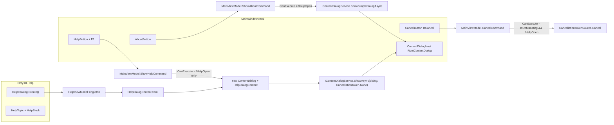
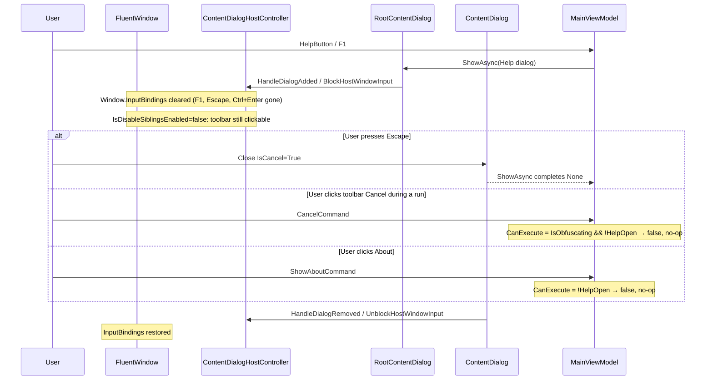
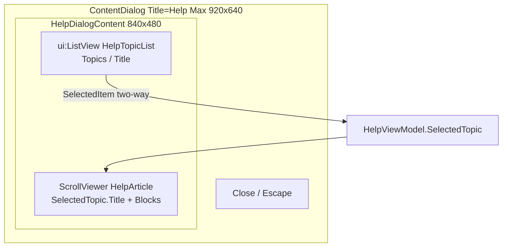

# Obfy Desktop Help Dialog

| Field | Value |
|---|---|
| **Author** | TBD |
| **Date** | 2026-09-13 |
| **Status** | Draft |
| **Product** | Obfy desktop UI (`Src/Obfy.UI`) |
| **Audience** | Desktop app only — CLI, Visual Studio, Rider, VS Code, and `docs/` are out of this surface |

## Overview

Obfy’s WPF Fluent workspace (`Src/Obfy.UI/Views/MainWindow.xaml`) is a three-panel obfuscation tool, not a NavigationView multi-page app. Today the only in-app documentation is the About ContentDialog — a two-line version string produced by `MainViewModel.ShowAboutAsync` via `IContentDialogService.ShowSimpleDialogAsync`. Users have no in-window explanation of Add Files, levels, Runtime profile, expanders, shortcuts, or Results.

This spec adds a **large in-window Help ContentDialog**: a two-pane topic list + article, opened from a toolbar Help button (question-mark icon, left of About) and **F1**. About stays the small version dialog (same title, copy, and `ShowSimpleDialogAsync` path). Content is an in-code catalog of six topics — no markdown renderer, no WebView2, no search. About’s command is gated while Help is open so the two dialogs cannot replace each other on `RootContentDialog`.

## Background & Motivation

### Current state

- Toolbar right cluster (`MainWindow.xaml` lines 82–102): Open output folder, Save Configuration, Load Configuration, **About**. No Help.
- InputBindings (`MainWindow.xaml` lines 19–25): Ctrl+O / Ctrl+S / Ctrl+L / Ctrl+Enter / Escape. **No F1.**
- About (`MainViewModel.ShowAboutAsync`, lines 490–501) calls `ShowSimpleDialogAsync` with title `"About Obfy"` and a string body. `SimpleContentDialogCreateOptions.Content` is typed as `object` in WPF-UI 4.3.0, but About treats it as a short paragraph and the helper does not set `DialogWidth` / `DialogMaxWidth`. That is why About is two sentences.
- Dialog host is already wired: `RootContentDialog` in `MainWindow.xaml` line 204, `contentDialogService.SetDialogHost(RootContentDialog)` in `MainWindow.xaml.cs` line 23, singleton `IContentDialogService` in `App.xaml.cs` line 39.
- Settings copy lives in expander **headers** in `SettingsPanel.xaml` (String Encryption, Constant Encryption, … Exclusions). Results copy lives in `ResultsPanel.xaml`. Files copy lives in `FilesPanel.xaml`. None of this is discoverable except by clicking around.
- Security note in `Claude.md` / README: string/constant/resource/method-IL “encryption” is obfuscation, not confidentiality. It is not surfaced in the desktop UI today.

### Pain points

1. First-run path (add files → level → Obfuscate → find output) is unlabeled beyond empty-state text in `FilesPanel.xaml`.
2. Runtime profile (`NativeAOT` / `Unity IL2CPP` / `Blazor WebAssembly`) silently changes what Protection can do; there is no in-app explanation.
3. Shortcuts exist in XAML only — they are not listed anywhere in the UI.
4. Results (`ShowResultsPanel`) appears only after a run; Export Map / Export Report / Preview are easy to miss.

## Goals & Non-Goals

### Goals

- Ship a read-only Help overlay in the desktop app that a new user can finish in under two minutes.
- Match on-screen control names exactly (Add Files, Obfuscate, Obfuscation level, Runtime profile, expander headers, Copy / Export Map / Export Report).
- Keep About visually the small version dialog (`AboutButton`, `ShowSimpleDialogAsync`, title `"About Obfy"`). A `CanExecute` stacking guard while Help is open is in scope; it is not a redesign of About.
- Allow Help while obfuscation is running.
- Prevent a second Help dialog from stacking, and prevent About from replacing Help (`CanShowAbout => !HelpOpen`). Help while About is open is a dead click (early return), not a disabled button.
- Cover the six locked topics, in the locked order, with the confidentiality sentence in Getting started.
- Test catalog copy, ViewModel selection, command enablement (including `HelpOpen` vs Cancel/About), XAML wiring, and FlaUI open / F1 / Escape-dismiss.

### Non-Goals (out of v1)

- Search inside Help.
- Deep-link from a settings toggle / expander into a topic.
- Markdown files, `docs/` links, WebView2, or any new NuGet package (including `WPF-UI.Markdown`).
- CLI, Visual Studio, Rider, or VS Code help.
- Version / license text (stays in About).
- Editing settings from Help; Help is read-only.
- Localizing Help copy (English only, same as the rest of the desktop UI).
- Changing whether Settings expanders are enabled on presets (they are already always enabled; Help describes that).
- FlaUI of Escape **during an in-flight obfuscation** (too heavy: needs a long-running mock pipeline in the live exe). The merge bar for that High risk is the `HelpOpen` unit test. Idle Escape-dismiss **is** in v1 FlaUI.
- An `AboutOpen` flag / disabling Help while About is showing. v1 accepts the dead click.

## Key Decisions

1. **ContentDialog overlay, not a page / drawer / Window.** The app is a single `FluentWindow` three-panel workspace. About already uses `RootContentDialog`. A second `Window` would break the in-window FlaUI pattern and Mica chrome. A NavigationView page would fight the existing layout.
2. **Custom `ContentDialog` + `IContentDialogService.ShowAsync`, not `ShowSimpleDialogAsync`.** WPF-UI 4.3.0’s `IContentDialogService.ShowAsync(ContentDialog, CancellationToken)` is the custom-content API. `ShowSimpleDialogAsync` is the About path: it constructs a default-sized dialog and does not set size. Help needs a large two-pane host. Chrome is capped with `DialogMaxWidth`/`DialogMaxHeight` = 920×640; **stable size comes from a fixed `Width`/`Height` on `HelpDialogContent`**, not from `DialogWidth`/`DialogHeight` (those DPs are overwritten on the first measure).
3. **In-code catalog, not markdown.** Six short topics. `HelpCatalog.Create()` is unit-testable without a renderer. Catalog bugs fail tests; there is no runtime fallback.
4. **Typed body blocks (`HelpParagraph` / `HelpShortcut` / `HelpNamedNote`), not a single string.** Lets XAML DataTemplates render shortcuts as key+action rows and technique notes as heading+one-liner without a markdown parser. Implicit `DataType` templates on `ItemsControl` (no `ItemTemplate`) — this project has no existing `DataType=` templates, so the snippet below is the contract.
5. **`HelpViewModel` is an Autofac `SingleInstance`.** First open selects Getting started; later opens keep `SelectedTopic`. Matches every other UI ViewModel in `AppModule`.
6. **Help is allowed during obfuscation; dialogs do not stack.** Settings/Files are disabled while `IsObfuscating` (`InverseBooleanConverter`), but Help is documentation. CommunityToolkit `AsyncRelayCommand` already sets `CanExecute = false` while `IsRunning`. An explicit `internal bool HelpOpen` is the testable guard for **clicking** toolbar Cancel / About (WPF-UI leaves siblings enabled). Window `InputBindings` are **not** the Escape path: `ContentDialogHostController.BlockHostWindowInput()` strips them for the life of the dialog. Escape dismisses Help via the dialog Close button (`IsCancel="True"`).
7. **Copy matches UI labels, second person, no marketing.** Expander header “Managed launcher” (lowercase L) is used as-is. Combo descriptions come from `ObfuscationLevel` / `RuntimeProfile` `[Description]` attributes. Shortcut Keys in the catalog are the user-facing strings (`Esc`, not XAML `Escape`). Row removal is **Remove file**.
8. **No new packages.** `QuestionCircle24` exists in WPF-UI 4.3.0 (`SymbolRegular`). DataTemplates + `ItemsControl` render blocks. Topic list is `ui:ListView` (same dark-theme contract as Files).
9. **`MainViewModel` constructs `HelpDialogContent`.** About only passes a string; Help is the first View constructed from a ViewModel command. Same assembly, UI thread. Unit tests do not `ExecuteAsync` that command (STA + host). A `ContentTemplate` on `ContentDialog` could avoid the new-up; not required for v1.

## Proposed Design

### Architecture



### WPF-UI 4.3.0 API (verified, do not guess)

Package: `WPF-UI` **4.3.0** (`Src/Obfy.UI/Obfy.UI.csproj`). XML docs + GitHub tag `4.3.0` source (`ContentDialog.cs`, `ContentDialog.xaml`, `ContentDialogHostController.cs`):

| API | Role |
|---|---|
| `Wpf.Ui.IContentDialogService.ShowAsync(ContentDialog dialog, CancellationToken cancellationToken)` | **Required** method on the interface. Token is **not** optional. Returns `Task<ContentDialogResult>`. |
| `Wpf.Ui.ContentDialogService.ShowAsync` | Sets `dialog.DialogHostEx` from the host registered in `MainWindow` ctor, then `return dialog.ShowAsync(cancellationToken)`. Throws `InvalidOperationException("The DialogHost was never set.")` if host is missing. |
| `ContentDialogServiceExtensions.ShowSimpleDialogAsync(IContentDialogService, SimpleContentDialogCreateOptions, CancellationToken = default)` | About path. Builds a `ContentDialog` from options; does **not** set size. |
| `SimpleContentDialogCreateOptions.Content` | Typed `object` (not `string`). About passes a string. Still the wrong helper for a two-pane layout. |
| `Wpf.Ui.Controls.ContentDialog` | `Title`, `Content` (inherited `ContentControl` — can be a `UserControl`), `CloseButtonText`, `DialogWidth` / `DialogHeight` (template binds chrome `MaxWidth`/`MaxHeight` to these; **`MeasureOverride` always overwrites them from content desired size**, then `ResizeWidth`/`ResizeHeight` only shrink when desired > Max). `DialogMaxWidth` (style default **1000**), `DialogMaxHeight` (style default **850**). Close button is `IsCancel="True"` (Escape). Empty `PrimaryButtonText` / `SecondaryButtonText` hide those buttons. |
| `ContentDialog.ShowAsync(CancellationToken cancellationToken = default)` | Assigns itself to `ContentDialogHost.Content` and awaits a TCS completed by Close/Primary/Secondary. |
| `ContentDialog.OnUnloadedInternal` | If this instance is replaced on the host before `Hide`, completes the TCS with `ContentDialogResult.None`. **Does not hang** in 4.3.0. The user would still see About instead of Help — that is the product hole the About `CanExecute` guard closes. |
| `ContentDialogHost.IsDisableSiblingsEnabled` | Defaults to **false**. Toolbar Cancel / About / Help stay clickable while a dialog is up. Do not turn this on for v1 (it would disable the whole workspace, including the in-flight progress UI). |
| `ContentDialogHostController.BlockHostWindowInput()` | On dialog add: copies then **clears `Window.InputBindings`**, clears `CommandBindings`, and suppresses AccessKeys / preview-executed commands whose target is not inside the host. Restored on dialog remove. F1 / Ctrl+Enter / Escape **KeyBindings do not fire** while Help (or About) is open. |

**Call shape for Help (this is the one to implement):**

```csharp
var dialog = new ContentDialog
{
    Title = "Help",
    Content = new HelpDialogContent { DataContext = _help },
    CloseButtonText = "Close",
    DialogMaxWidth = 920,
    DialogMaxHeight = 640,
    // Optional first-frame hint only — MeasureOverride overwrites these from content.
    DialogWidth = 920,
    DialogHeight = 640,
};
dialog.SetValue(ScrollViewer.VerticalScrollBarVisibilityProperty, ScrollBarVisibility.Disabled);

await _contentDialogService.ShowAsync(dialog, CancellationToken.None);
```

**Do not claim `DialogWidth`/`DialogHeight` pin chrome.** In WPF-UI 4.3.0 `MeasureOverride` always writes desired size into those DPs, then only **shrinks** when desired > Max. Setting Width=Height=Max is the same as Max-only after the first layout pass.

**Pin is on `HelpDialogContent`:** `Width="840"` `Height="480"` (and the same `MinWidth`/`MinHeight` so it cannot shrink). Math: `DialogMax` 920×640 minus `DialogMargin` 35×2 (style default) leaves 850×570 for the card including title and footer; 840×480 is the two-pane body inside that. The article `ScrollViewer` absorbs Techniques vs Getting started length. Topic switches then report a constant desired size to `MeasureOverride`.

`DialogMaxWidth`/`DialogMaxHeight` = 920×640 remain the **ceiling** so a layout glitch cannot grow past the overlay. `DialogWidth`/`DialogHeight` may be set as a first-frame hint; they are not the pin.

Do **not** call `dialog.ShowAsync(...)` from `MainViewModel` — the ViewModel has no `ContentDialogHost`. Do **not** call `ShowAsync(dialog)` without a token; that overload is not on `IContentDialogService`. Do **not** pass the obfuscation `CancellationTokenSource` — cancelling a run must not dismiss Help.

`MainViewModel.cs` needs these additional usings (it today has no `Obfy.UI.Views` dependency; About only passes a string):

```csharp
using System.Windows.Controls; // ScrollViewer, ScrollBarVisibility
using Obfy.UI.Views;           // HelpDialogContent
```

### Keyboard and sibling input while Help is open



| Input | While Help is open | Mechanism |
|---|---|---|
| F1 / Ctrl+O / Ctrl+S / Ctrl+L / Ctrl+Enter KeyBindings | Do not fire | `BlockHostWindowInput` clears `Window.InputBindings` |
| Escape | Dismisses Help | Dialog Close `IsCancel="True"`; window Escape KeyBinding is stripped |
| Click **Cancel** (visible during a run) | Must not cancel the run | `CanCancel` includes `!HelpOpen`. Merge-bar unit test. |
| Click **About** | Must not replace Help | `CanShowAbout` includes `!HelpOpen` (button disables). Unit-tested. |
| Click **Help** while Help is already open | No-op | `CanShowHelp` includes `!HelpOpen`; `AsyncRelayCommand.IsRunning` is a twin |
| Click **Help** while **About** is open | Dead click (button stays enabled); dialog is not replaced | `CanShowHelp` is still **true** (`HelpOpen` is false; there is no `AboutOpen`). `ShowHelpAsync` returns after `GetDialogHostEx()?.Content is ContentDialog`. Accepted for v1 — do not add an `AboutOpen` flag. |

`HelpOpen` in `CanCancel` is **not** what stops the Escape KeyBinding (the host controller already did). It is the guard for the clickable Cancel button and a belt-and-suspenders backup if host input blocking changes in a later WPF-UI version.

Escape-during-obfuscation **FlaUI is out of v1**. Idle Escape-dismiss FlaUI **is in v1**.

### Open / close sequence

```mermaid
sequenceDiagram
    participant User
    participant MainWindow
    participant MainVM as MainViewModel
    participant HelpVM as HelpViewModel
    participant Svc as IContentDialogService
    participant Host as RootContentDialog

    User->>MainWindow: HelpButton or F1
    MainWindow->>MainVM: ShowHelpCommand
    alt HelpOpen
        MainVM-->>User: no-op (CanExecute false)
    else host Content is already a ContentDialog (About)
        MainVM-->>User: no-op (early return; Help button still enabled)
    else
        MainVM->>MainVM: HelpOpen = true
        MainVM->>HelpVM: DataContext (singleton, last SelectedTopic)
        MainVM->>Svc: ShowAsync(ContentDialog Title=Help, token=None)
        Svc->>Host: Content = dialog
        Note over User,Host: Left list changes SelectedTopic only; dialog stays open
        User->>Host: Close or Escape
        Host-->>Svc: ContentDialogResult.None
        Svc-->>MainVM: task completes
        MainVM->>MainVM: HelpOpen = false (finally)
    end
```

- **Open:** toolbar `HelpButton` or F1 → `ShowHelpCommand`.
- **Default topic:** first process open → Getting started (`Topics[0]`). Subsequent opens keep `HelpViewModel.SelectedTopic`.
- **Switch topic:** left `ui:ListView` sets `SelectedTopic`; does not close the dialog. `HelpDialogContent` is a fixed 840×480, so `MeasureOverride` sees the same desired size; the article `ScrollViewer` scrolls long topics.
- **Close:** ContentDialog Close button or Escape (`IsCancel="True"` on the Close button in WPF-UI’s template). No extra close control in `HelpDialogContent`.
- **During obfuscation:** Help remains enabled. Settings panel and Files panel stay disabled via existing converters. Toolbar Cancel stays visible (existing `IsObfuscating` converter) but `CancelCommand` cannot execute.

### Two-pane interior



**Left (~220 px):** `ui:ListView` only — not a stock `ListBox` / `ListView`. `Tests/Obfy.UI.Tests/Views/FilesPanelXamlTests.cs` documents that stock WPF `ListViewItem` uses `SystemColors.ControlTextBrush` (black), unreadable on the dark Fluent theme; Files therefore uses `ui:ListView`. Help follows that contract.

- `ItemsSource="{Binding Topics}"`
- `SelectedItem="{Binding SelectedTopic}"`
- `AutomationProperties.AutomationId="HelpTopicList"`
- `AutomationProperties.Name="Help topics"`
- `Background="{DynamicResource SubtleFillColorTransparentBrush}"` `BorderThickness="0"` (same as Files)
- `ItemContainerStyle` `TargetType="ListViewItem"`: `AutomationProperties.Name` = `{Binding Title}`, `Foreground` = `{DynamicResource TextFillColorPrimaryBrush}`
- Item text: `ItemTemplate` with `ui:TextBlock` `Text="{Binding Title}"` `Foreground="{DynamicResource TextFillColorPrimaryBrush}"` (do not rely on `DisplayMemberPath` alone — that can inherit unthemed item chrome)

**Right (`*`):** topic title (`BodyStrong`) + `ItemsControl` of `SelectedTopic.Blocks`. Inner `ScrollViewer` only on the article (`AutomationProperties.AutomationId="HelpArticle"` `AutomationProperties.Name="Help article"`).

**Nested scroll:** WPF-UI’s ContentDialog template wraps `Content` in `PassiveScrollViewer` (`PART_ContentScroll`, `VerticalScrollBarVisibility=Auto`). For a two-pane layout that would scroll the topic list away. Set `ScrollViewer.VerticalScrollBarVisibility="Disabled"` on the `ContentDialog` instance so only the article pane scrolls.

**Size:**

| Knob | Value | Role |
|---|---|---|
| `HelpDialogContent` `Width` / `Height` / `MinWidth` / `MinHeight` | **840×480** | **The pin.** Constant desired size so topic switches do not jump. |
| `ContentDialog.DialogMaxWidth` / `DialogMaxHeight` | **920×640** | Ceiling. `ResizeWidth`/`ResizeHeight` shrink only if desired exceeds this. |
| `ContentDialog.DialogWidth` / `DialogHeight` | 920×640 optional | First-frame hint. `MeasureOverride` overwrites from content; not a pin. |
| Article `ScrollViewer` | `VerticalScrollBarVisibility="Auto"` | Absorbs Getting started vs Techniques length inside the fixed 840×480. |

840×480 fits inside 920×640 minus `DialogMargin` 35×2 (card interior 850×570) minus title + footer. Do not use `MinHeight="420"` alone — that is a floor and still lets Techniques grow until Max.

### File / type map

| Piece | Path | Responsibility |
|---|---|---|
| `HelpBlock` hierarchy | `Src/Obfy.UI/Help/HelpBlocks.cs` | `HelpParagraph`, `HelpShortcut`, `HelpNamedNote` |
| `HelpTopic` | `Src/Obfy.UI/Help/HelpTopic.cs` | `Id`, `Title`, `Blocks` |
| `HelpCatalog` | `Src/Obfy.UI/Help/HelpCatalog.cs` | Ordered six-topic factory |
| `HelpViewModel` | `Src/Obfy.UI/ViewModels/HelpViewModel.cs` | `Topics`, `SelectedTopic` |
| `HelpDialogContent` | `Src/Obfy.UI/Views/HelpDialogContent.xaml` (+ `.xaml.cs`) | Two-pane view (`ui:ListView` + article). Fixed **840×480**. |
| `ShowHelpCommand` | `Src/Obfy.UI/ViewModels/MainViewModel.cs` | Build + `ShowAsync`. Additional usings: `Obfy.UI.Views`, `System.Windows.Controls`. |
| `HelpOpen` seam | `Src/Obfy.UI/ViewModels/MainViewModel.cs` | `internal bool HelpOpen`; `InternalsVisibleTo` in `Obfy.UI.csproj` |
| Registration | `Src/Obfy.UI/DependencyInjection/AppModule.cs` | `HelpViewModel` `SingleInstance` |
| Toolbar + F1 | `Src/Obfy.UI/Views/MainWindow.xaml` | `HelpButton`, `KeyBinding Key="F1"` |

`App.xaml.cs` and `MainWindow.xaml.cs` do **not** change — host registration is already correct.

## API / Interface Changes

No public library API. Desktop-only types. `HelpOpen` is `internal` (test seam), not a shipped public property.

### `HelpTopic` / blocks

```csharp
namespace Obfy.UI.Help;

public sealed record HelpTopic(
    string Id,
    string Title,
    IReadOnlyList<HelpBlock> Blocks);

public abstract record HelpBlock;

public sealed record HelpParagraph(string Text) : HelpBlock;

public sealed record HelpShortcut(string Keys, string Action) : HelpBlock;

public sealed record HelpNamedNote(string Heading, string Text) : HelpBlock;
```

Invariants (enforced by `HelpCatalogTests`, not by runtime fallbacks):

- `Id` is lowercase kebab-case, unique, stable (do not rename without updating tests).
- `Title` is the left-list label and the article heading.
- `Blocks` is never empty; paragraph/note/shortcut strings are never null or whitespace.
- Shortcut `Keys` for Escape is the locked string **`Esc`** (not `Escape`). XAML remains `Key="Escape"`.

### `HelpCatalog`

```csharp
namespace Obfy.UI.Help;

public static class HelpCatalog
{
    public const string GettingStartedId = "getting-started";
    public const string FilesOutputId = "files-output";
    public const string SettingsLevelsId = "settings-levels";
    public const string TechniquesId = "techniques";
    public const string ShortcutsId = "shortcuts";
    public const string ResultsId = "results";

    /// <summary>
    /// Confidentiality sentence required in Getting started.
    /// </summary>
    public const string ConfidentialitySentence =
        "String, constant, resource, and method encryption is obfuscation, not secrecy: the keys live in the output assembly and are recoverable by anyone who runs or inspects it.";

    public static IReadOnlyList<HelpTopic> Create() { /* six topics, this order */ }
}
```

`Create()` returns a **new** list each call so tests cannot mutate a shared singleton. `HelpViewModel` calls it once in its constructor.

### `HelpViewModel`

```csharp
namespace Obfy.UI.ViewModels;

public partial class HelpViewModel : ObservableObject
{
    public IReadOnlyList<HelpTopic> Topics { get; }

    [ObservableProperty]
    private HelpTopic _selectedTopic;

    public HelpViewModel()
    {
        Topics = HelpCatalog.Create();
        _selectedTopic = Topics[0]; // Getting started
    }
}
```

No commands. Selection is two-way `ui:ListView.SelectedItem`. Register in `AppModule` next to the other ViewModels:

```csharp
builder.RegisterType<HelpViewModel>()
    .AsSelf()
    .SingleInstance();
```

Inject into `MainViewModel` as a constructor parameter (`HelpViewModel help`) and store in `private readonly HelpViewModel _help`. Update `MainViewModelTests`’s constructor call accordingly.

### `MainViewModel.ShowHelpAsync` and stacking guards

Follow existing `[RelayCommand]` / `IContentDialogService` patterns. About stays on `ShowSimpleDialogAsync` (same title and string body). Add `CanExecute` only.

Test seam — `internal` property, not `[ObservableProperty]` public. Matches `Obfy.Core` → `Obfy.Tests` InternalsVisibleTo. Add to `Src/Obfy.UI/Obfy.UI.csproj` (no new packages):

```xml
<ItemGroup>
  <InternalsVisibleTo Include="Obfy.UI.Tests" />
</ItemGroup>
```

(`AssemblyName` is `ObfyUI`; InternalsVisibleTo uses the **test assembly name** `Obfy.UI.Tests`, same pattern as `Obfy.Core.csproj` → `Obfy.Tests`.)

```csharp
private bool _helpOpen;

internal bool HelpOpen
{
    get => _helpOpen;
    set
    {
        if (!SetProperty(ref _helpOpen, value))
            return;
        ShowHelpCommand.NotifyCanExecuteChanged();
        ShowAboutCommand.NotifyCanExecuteChanged();
        CancelCommand.NotifyCanExecuteChanged();
    }
}

private bool CanShowHelp() => !HelpOpen;

private bool CanShowAbout() => !HelpOpen;

private bool CanCancel() => IsObfuscating && !HelpOpen;

[RelayCommand(CanExecute = nameof(CanShowHelp))]
private async Task ShowHelpAsync()
{
    if (HelpOpen)
        return;
    // About (or any ContentDialog) already on the host: dead click. CanShowHelp is
    // still true — no AboutOpen flag in v1. Prevents replacement; button stays enabled.
    if (_contentDialogService.GetDialogHostEx()?.Content is ContentDialog)
        return;

    HelpOpen = true;
    try
    {
        var content = new HelpDialogContent { DataContext = _help };
        var dialog = new ContentDialog
        {
            Title = "Help",
            Content = content,
            CloseButtonText = "Close",
            DialogMaxWidth = 920,
            DialogMaxHeight = 640,
            DialogWidth = 920,   // first-frame hint only
            DialogHeight = 640,
        };
        dialog.SetValue(
            ScrollViewer.VerticalScrollBarVisibilityProperty,
            ScrollBarVisibility.Disabled);

        await _contentDialogService.ShowAsync(dialog, CancellationToken.None);
    }
    finally
    {
        HelpOpen = false;
    }
}

[RelayCommand(CanExecute = nameof(CanShowAbout))]
private async Task ShowAboutAsync()
{
    if (HelpOpen)
        return;

    var versionText = GetInformationalVersion();

    await _contentDialogService.ShowSimpleDialogAsync(new SimpleContentDialogCreateOptions
    {
        Title = "About Obfy",
        Content = $"Version {versionText}\n\n.NET Obfuscation Tool that protects C# assemblies and source code.",
        CloseButtonText = "Close"
    });
}
```

**No try/catch around `ShowAsync`.** About does not catch; `App.OnDispatcherUnhandledException` already shows a Close dialog. Do **not** add a snackbar. `finally` exists only to clear `HelpOpen` if `ShowAsync` throws (`DialogHost was never set`, etc.).

Host already-showing check: if About is up, Help **looks clickable** (`CanShowHelp` is true) and the click no-ops. That dead click is accepted for v1; do not add `AboutOpen`. Combined with `CanShowAbout => !HelpOpen`, About cannot replace Help (button disables). The reverse is the early return, not a `CanExecute` guard. In 4.3.0 a replacement would complete the previous TCS with `None` (`OnUnloadedInternal`) rather than hang.

`ShowHelpCommand` has **no** `CanExecute` dependency on `IsObfuscating`.

### `MainWindow.xaml` wiring

1. InputBindings — add with the existing set:

```xml
<KeyBinding Key="F1" Command="{Binding ShowHelpCommand}"/>
```

2. Toolbar — insert **immediately left of** About (right cluster, after Load Configuration):

```xml
<ui:Button Icon="{ui:SymbolIcon QuestionCircle24}" ToolTip="Help (F1)"
          AutomationProperties.Name="Help"
          AutomationProperties.AutomationId="HelpButton"
          AutomationProperties.HelpText="Open Help. Shortcut: F1."
          MinWidth="40" MinHeight="40"
          Command="{Binding ShowHelpCommand}" Margin="0,0,4,0"/>
<ui:Button Icon="{ui:SymbolIcon Info24}" ToolTip="About"
          ... existing AboutButton ...
```

`QuestionCircle24` is present in WPF-UI 4.3.0 (`SymbolRegular`). Do not use `Info24` (that is About).

3. About button, `RootContentDialog`, and existing shortcuts stay as they are.

### `HelpDialogContent.xaml` sketch

UserControl, `d:DataContext` = `HelpViewModel`. Theme tokens: `TextFillColorPrimaryBrush`, `TextFillColorSecondaryBrush`, `CardBackgroundFillColorDefaultBrush`, `ControlElevationBorderBrush` — same as `FilesPanel` / `SettingsPanel`.

This project has **zero** existing `DataType=` templates. Implicit templates apply only when `ItemsControl.ItemTemplate` is **unset**. Records work with `DataType="{x:Type ...}"`. Implement exactly this shape (trim/spacing may match surrounding panels):

```xml
<UserControl x:Class="Obfy.UI.Views.HelpDialogContent"
             xmlns="http://schemas.microsoft.com/winfx/2006/xaml/presentation"
             xmlns:x="http://schemas.microsoft.com/winfx/2006/xaml"
             xmlns:ui="http://schemas.lepo.co/wpfui/2022/xaml"
             xmlns:help="clr-namespace:Obfy.UI.Help"
             xmlns:vm="clr-namespace:Obfy.UI.ViewModels"
             d:DataContext="{d:DesignInstance Type=vm:HelpViewModel}"
             Width="840" Height="480"
             MinWidth="840" MinHeight="480">
  <Grid>
    <Grid.ColumnDefinitions>
      <ColumnDefinition Width="220"/>
      <ColumnDefinition Width="*"/>
    </Grid.ColumnDefinitions>

    <ui:ListView x:Name="TopicList"
                 Grid.Column="0"
                 AutomationProperties.AutomationId="HelpTopicList"
                 AutomationProperties.Name="Help topics"
                 ItemsSource="{Binding Topics}"
                 SelectedItem="{Binding SelectedTopic}"
                 Background="{DynamicResource SubtleFillColorTransparentBrush}"
                 BorderThickness="0"
                 HorizontalContentAlignment="Stretch">
      <ui:ListView.ItemContainerStyle>
        <Style TargetType="ListViewItem">
          <Setter Property="AutomationProperties.Name" Value="{Binding Title}"/>
          <Setter Property="Foreground" Value="{DynamicResource TextFillColorPrimaryBrush}"/>
        </Style>
      </ui:ListView.ItemContainerStyle>
      <ui:ListView.ItemTemplate>
        <DataTemplate>
          <ui:TextBlock Text="{Binding Title}"
                        Foreground="{DynamicResource TextFillColorPrimaryBrush}"/>
        </DataTemplate>
      </ui:ListView.ItemTemplate>
    </ui:ListView>

    <ScrollViewer Grid.Column="1"
                  AutomationProperties.AutomationId="HelpArticle"
                  AutomationProperties.Name="Help article"
                  VerticalScrollBarVisibility="Auto"
                  HorizontalScrollBarVisibility="Disabled">
      <StackPanel>
        <ui:TextBlock Text="{Binding SelectedTopic.Title}"
                      FontTypography="BodyStrong"
                      Foreground="{DynamicResource TextFillColorPrimaryBrush}"/>
        <ItemsControl ItemsSource="{Binding SelectedTopic.Blocks}">
          <ItemsControl.Resources>
            <DataTemplate DataType="{x:Type help:HelpParagraph}">
              <ui:TextBlock Text="{Binding Text}" TextWrapping="Wrap"
                            Margin="0,8,0,0"
                            Foreground="{DynamicResource TextFillColorPrimaryBrush}"/>
            </DataTemplate>
            <DataTemplate DataType="{x:Type help:HelpShortcut}">
              <Grid Margin="0,6,0,0">
                <Grid.ColumnDefinitions>
                  <ColumnDefinition Width="120"/>
                  <ColumnDefinition Width="*"/>
                </Grid.ColumnDefinitions>
                <ui:TextBlock Grid.Column="0" Text="{Binding Keys}"
                              FontFamily="Cascadia Mono, Consolas"
                              Foreground="{DynamicResource TextFillColorPrimaryBrush}"/>
                <ui:TextBlock Grid.Column="1" Text="{Binding Action}"
                              Foreground="{DynamicResource TextFillColorPrimaryBrush}"/>
              </Grid>
            </DataTemplate>
            <DataTemplate DataType="{x:Type help:HelpNamedNote}">
              <StackPanel Margin="0,10,0,0">
                <ui:TextBlock Text="{Binding Heading}" FontTypography="BodyStrong"
                              Foreground="{DynamicResource TextFillColorPrimaryBrush}"/>
                <ui:TextBlock Text="{Binding Text}" TextWrapping="Wrap"
                              Foreground="{DynamicResource TextFillColorSecondaryBrush}"/>
              </StackPanel>
            </DataTemplate>
          </ItemsControl.Resources>
        </ItemsControl>
      </StackPanel>
    </ScrollViewer>
  </Grid>
</UserControl>
```

Do **not** set `ItemsControl.ItemTemplate` — that would shadow the implicit `DataType` templates and render `ToString()`.

No hyperlinks, no buttons other than the dialog Close. Code-behind: `InitializeComponent()` only.

## Data Model Changes

None in `Obfy.Core` / `obfy.json` / `%APPDATA%\Obfy\obfy.json`. Help is compile-time copy. No migration.

Do not confuse:

| Store | Path | Help mention? |
|---|---|---|
| App preferences | `%APPDATA%\Obfy\obfy.json` | No — not a user-facing control |
| Save Configuration default filename | `obfy-config.json` (`FileDialogService.ShowSaveConfigDialog`) | Yes, as the save-dialog default; on-screen names are **Save Configuration** / **Load Configuration** |
| Symbol map after a run | `FilesViewModel.ResolveSymbolMapPath()` → `Files.SymbolMapPath` if set, else `{Output Directory or input dir}/symbolmap.json` | **Implementer only** — not catalog copy. User-facing Files sentence names **Write symbol map after obfuscation**, `symbolmap.json`, and **Output Directory**. |
| Export Map | user-chosen path via save dialog (`ShowSaveSymbolMapDialog`, default `symbolmap.json`) | Results topic (**Export Map**) — different action |

## Catalog copy (locked topics, this order)

Tone: second person, short, no marketing. If a control has an on-screen name, use that name. No CLI, no IDE, no `docs/` links.

### 1. Getting started (`getting-started`)

Blocks:

1. **Paragraph:** Add `.dll`, `.exe`, or `.cs` files with **Add Files**, or drop them onto **Input Files**.
2. **Paragraph:** Pick an **Obfuscation level**, then click **Obfuscate** (Ctrl+Enter).
3. **Paragraph:** Output goes to **Output Directory**. If that box is empty, files are written next to the input as `*.obfuscated.*`.
4. **Paragraph:** `HelpCatalog.ConfidentialitySentence` (exact string above).

### 2. Files & output (`files-output`)

1. **Paragraph:** **Add Files** (Ctrl+O) opens a multi-select picker for `.dll`, `.exe`, and `.cs`. **Clear** removes the whole list; **Remove file** on a row removes one file.
2. **Paragraph:** You can drag and drop assemblies onto **Input Files**. The empty state says “Drag and drop assemblies here” / “or click Add Files (.dll, .exe, .cs)”.
3. **Paragraph:** Set **Output Directory** (or **Browse output directory**). The toolbar **Open output folder** button opens the folder of the last written output.
4. **Paragraph:** **Save Configuration** (Ctrl+S) and **Load Configuration** (Ctrl+L) write and read a JSON settings file. The save dialog defaults to `obfy-config.json`.
5. **Paragraph:** **Write symbol map after obfuscation** writes `symbolmap.json` in **Output Directory**, or next to the input if that box is empty. This is automatic after a run; **Export Map** on **Obfuscation Results** is a separate save-as. Do not mention `Files.SymbolMapPath` in catalog copy.
6. **Paragraph:** **Merge input assemblies** combines the files in **Input Files** into one output. **Embed referenced DLLs** packs sibling referenced DLLs into the result. Use the **Assembly Merge** expander; this is not a merge tutorial.

### 3. Settings & levels (`settings-levels`)

Use the combo `[Description]` strings from `Src/Obfy.Core/Models/ObfuscationLevel.cs` and `RuntimeProfile` in `ObfySettings.cs`:

1. **Paragraph:** **Obfuscation level** is Minimal — symbol renaming only; Standard — rename, encrypt strings, strip metadata; Aggressive — all protections at high intensity; or Custom.
2. **Paragraph:** Choosing Minimal, Standard, or Aggressive fills the expanders so you can see what that preset turned on. Change any setting and **Obfuscation level** switches to Custom. Custom is how you edit techniques freely; the expanders stay readable on a preset.
3. **Paragraph:** **Runtime profile** is Default, NativeAOT, Unity IL2CPP, or Blazor WebAssembly. NativeAOT, Unity IL2CPP, and Blazor WebAssembly change what Protection can do (Method IL Encryption, Anti-Dump, and embedding are gated; Anti-Debug stays on without kernel32 P/Invoke). Pick the profile that matches how the output will run.

Do **not** claim expanders are disabled on presets — `SettingsPanel.xaml` does not bind `IsEnabled` to Custom. `SettingsViewModel.OnPropertyChanged` flips `Level` to Custom on the first edit (`SettingsViewModel.cs` lines 359–368).

### 4. Techniques (`techniques`)

One `HelpNamedNote` per settings expander, **header string exact**:

| Heading (expander `Header`) | One-liner |
|---|---|
| String Encryption | Encrypts string literals (XOR or AES-256). This is obfuscation, not secrecy. |
| Constant Encryption | Encrypts numeric constants (int, long, float, double) with XOR or AES-256. |
| Control Flow | Rewrites method flow with switch flattening, opaque predicates, or both. |
| Symbol Renaming | Renames types, methods, fields, properties, parameters, events, and namespaces. |
| Protection | Anti-Debug, Anti-Tamper, Anti-Dump, Anti-Decompiler, Reference Proxy, and Method IL Encryption. |
| Metadata | Remove Debug Info, Remove Attributes, and Strip Documentation. |
| Watermark | Embeds a Customer / build id. The id is required when Watermark is on. |
| Managed launcher | Pack managed launcher, Incremental cache, and Virtualize simple methods. |
| Strong-Name Signing | Re-signs the output with a Key file (.snk / .pfx). |
| Resource Encryption | Encrypts embedded resources (XOR or AES-256). This is obfuscation, not secrecy. |
| Assembly Merge | Merge input assemblies into one output, and optionally Embed referenced DLLs. |
| Exclusions | Namespaces, types, and methods you do not want renamed or transformed. |

No pipeline-priority tables. No per-toggle walkthrough.

### 5. Shortcuts (`shortcuts`)

`HelpShortcut` rows. Catalog `Keys` are the **user-facing** strings (locked). XAML uses `Key="Escape"`; tests assert catalog `Keys == "Esc"`, not `"Escape"`.

| Keys (catalog / Help UI) | Action (on-screen name) | XAML |
|---|---|---|
| Ctrl+O | Add Files | `Key="O" Modifiers="Control"` |
| Ctrl+S | Save Configuration | `Key="S" Modifiers="Control"` |
| Ctrl+L | Load Configuration | `Key="L" Modifiers="Control"` |
| Ctrl+Enter | Obfuscate | `Key="Enter" Modifiers="Control"` |
| Esc | Cancel | `Key="Escape"` |
| F1 | Help | `Key="F1"` (new) |

Leading paragraph: “These shortcuts work in the main window.” Esc still cancels an in-flight run when Help is **not** open; while Help is open, Esc closes Help (dialog Close `IsCancel`, window KeyBinding stripped).

### 6. Results (`results`)

1. **Paragraph:** **Obfuscation Results** appears under **Input Files** after a run (`ShowResultsPanel`).
2. **Paragraph:** The summary counts Strings, Types, Methods, Fields, Control Flow, and Total.
3. **Paragraph:** **Symbols** lists original → obfuscated names. **Preview** shows a decompile of the last assembly output when one exists.
4. **Paragraph:** **Copy** copies the selected mapping. **Export Map** writes the symbol map (save dialog, default `symbolmap.json`). **Export Report** writes the run report.

## Alternatives Considered

### 1. `ShowSimpleDialogAsync` with a UserControl as `Content`

`SimpleContentDialogCreateOptions.Content` is `object`, so a UserControl would compile. **Rejected:** the helper never sets dialog size; it is the About-sized path; product decision is a custom `ContentDialog`. Using it would couple Help to About’s helper and make sizing implicit.

### 2. WPF-UI `NavigationView` page or full-window overlay

**Rejected:** the shell is a three-panel workspace (`MainWindow.xaml` Grid), not a multi-page NavigationView app. A page would hide the workspace Help is documenting. Product decision: modal overlay, same family as About.

### 3. Separate `Window` (Win32 dialog)

**Rejected:** FlaUI About tests assert the dialog is a descendant of `MainWindow` (`AboutDialogTests`: “About is a WPF-UI ContentDialog overlay, not a separate window”). A second window breaks that, loses Mica, and complicates always-on-top / owner relationships.

### 4. Markdown files + `WPF-UI.Markdown` or WebView2

**Rejected:** new package (forbidden), harder catalog tests, and `docs/` is explicitly out of this surface. Six topics fit in C#.

### 5. Side drawer / `Flyout` attached to the Help button

**Rejected:** too narrow for technique notes + shortcuts; product decision is a large two-pane dialog.

### 6. `ContentDialog.ContentTemplate` instead of `new HelpDialogContent()` in the ViewModel

Would keep `MainViewModel` free of `Obfy.UI.Views`. **Not required for v1:** Help is the only custom-content dialog; the command already runs on the UI thread; a factory/`DataTemplate` is extra indirection. Documented as a future cleanup, not a blocker.

### 7. Enable `ContentDialogHost.IsDisableSiblingsEnabled`

Would grey out Cancel/About while Help is open. **Rejected for v1:** default is false; turning it on disables the whole sibling tree (progress UI, status bar) during a run, which is worse than a `CanExecute` guard on two commands.

## Security & Privacy Considerations

| Topic | Detail |
|---|---|
| Confidentiality note | Getting started **must** include `HelpCatalog.ConfidentialitySentence`. Tests assert the substring. This is the desktop surface for the `Claude.md` / README warning. |
| Secrets | Help copy must not tell users to put keys, tokens, or credentials in the assembly and “encrypt” them. |
| Read-only | Help does not read project files, settings, or logs. No telemetry. |
| Threat model | Help is local UI. No network, no `docs/` fetch, no WebView2 (no extra Chromium attack surface). |
| Watermark id | Techniques note that **Customer / build id** is required when Watermark is on — that id is user data already stored in settings, not collected by Help. |

## Observability

Match About: **no snackbar, no new NLog events required.** `ShowAboutAsync` does not log.

Optional (not required for v1): `ILogger<MainViewModel>` debug line on open/close. If added, use existing `Logging.Core` and write to `%LOCALAPPDATA%\Obfy\Logs\` — do not introduce a new sink.

Failures:

- Catalog mistakes → unit test failures at PR time, not a runtime placeholder topic.
- `ShowAsync` throws → existing `App.OnDispatcherUnhandledException` dialog (`App.xaml.cs` lines 52–77). No extra Help-specific error UI.

No metrics or alerts; this is a desktop dialog, not a service.

## Rollout Plan

- **Feature flag:** none. Desktop-only; ship in the next Obfy.UI version (currently `1.3.0` in `Obfy.UI.csproj` — bump is a release concern, not this change).
- **Staged rollout:** not applicable (no Store experiment). MSIX/sideload get Help when this ships.
- **Rollback:** revert the single PR. No settings schema to migrate. Users who never opened Help are unaffected.
- **Implementation location:** feature branch/worktree under `.worktrees/` per `Claude.md` (`git worktree add .worktrees/<branch-name> -b <branch-name>`). This spec names the files; it does not create the worktree.

## Risks

| Risk | Severity | Mitigation | Merge bar |
|---|---|---|---|
| Clickable toolbar **Cancel** during a run while Help is open | **High** | `HelpOpen` in `CanCancel()`. CommunityToolkit `RelayCommand.Execute` no-ops when `CanExecute` is false. Unit test: `IsObfuscating = true`, `HelpOpen = true` → `CancelCommand.CanExecute(null)` is false. | **Required unit test** (`MainViewModelTests`). FlaUI of Escape-during-run is **out of v1**. |
| Escape KeyBinding vs dialog Close | Low (host already strips InputBindings) | Documented 4.3.0 `BlockHostWindowInput`. Dialog Close `IsCancel=True`. Idle Escape-dismiss FlaUI in v1. | FlaUI `HelpDialog_Escape_DismissesIt` |
| FlaUI `ByName("Help")` matches the toolbar button, not the dialog title | **High** | Assert `HelpTopicList` / `HelpArticle` AutomationIds after click, not `FindFirstDescendant(ByName("Help"))`. Title string is still `"Help"` for humans. | FlaUI open/close tests |
| Nested `PassiveScrollViewer` on ContentDialog steals two-pane layout | **Medium** | Disable vertical scroll on the dialog; scroll only the article. | Code review of call shape |
| About replaces Help on the same host | **Medium** | In 4.3.0 replacement completes Help’s TCS with `None` (no hang) but swaps the UI. `CanShowAbout => !HelpOpen` (unit-tested). | **Required unit test** |
| Help click while About is open | **Low** | Dead click: `CanShowHelp` stays true; `ShowHelpAsync` returns if host `Content is ContentDialog`. No `AboutOpen`. | Code review of early return. Do not `ExecuteAsync` in unit tests. |
| Chrome jumps Getting started ↔ Techniques | **Medium** | Pin `HelpDialogContent` to **840×480** (`Width`/`Height`/`MinWidth`/`MinHeight`). `DialogMax*` = 920×640 is a ceiling only. Article `ScrollViewer` absorbs topic length. | `HelpDialogContentXamlTests` asserts 840×480. |
| Stock `ListBox` black text on dark theme | **Medium** | Lock `ui:ListView` + themed `ItemContainerStyle` / `ItemTemplate`. | `HelpDialogContentXamlTests` |
| Constructing `HelpDialogContent` in `ShowHelpCommand.Execute` requires STA | **Medium** | Unit tests assert `CanExecute` / `HelpOpen`, not `ExecuteAsync`. FlaUI covers the real dialog. Do not add `Xunit.StaFact`. | Do not Execute in `Obfy.UI.Tests` |
| Help copy drifts from expander headers | **Low** | `HelpCatalogTests` asserts the twelve heading strings equal the `CardExpander Header` values. | Catalog tests |
| `AsyncRelayCommand` concurrent execution | **Low** | Default `AllowConcurrentExecutions` is false. Keep `CanShowHelp => !HelpOpen` as an explicit twin. | `HelpOpen` unit test |

## Testing

Existing style: **xunit + Moq + Shouldly**. `Obfy.UI.Tests` has `UseWPF=true`. FlaUI tests are `[Trait("Category", "UI")]` and are skipped by default `dotnet test` / CI (`AboutDialogTests.cs` comment). Do not switch to NSubstitute. Local FlaUI is run the same way About already is — **not CI**.

Do **not** call `ShowHelpCommand.ExecuteAsync` in `Obfy.UI.Tests` — `ShowAsync` throws `"The DialogHost was never set."` and `HelpDialogContent` needs STA. Drive stacking via `HelpOpen`.

### `Tests/Obfy.UI.Tests/Help/HelpCatalogTests.cs`

- `Create()` returns **6** topics, ids exactly `getting-started`, `files-output`, `settings-levels`, `techniques`, `shortcuts`, `results` in that order.
- Titles: Getting started, Files & output, Settings & levels, Techniques, Shortcuts, Results.
- Every topic has `Blocks.Count >= 1`; no block with empty text / keys / heading.
- Getting started `Blocks` of type `HelpParagraph` concatenated contain `HelpCatalog.ConfidentialitySentence`.
- Files & output concatenated paragraphs contain **Write symbol map after obfuscation**, **Output Directory**, `symbolmap.json`, and **Remove file**. They must **not** contain `SymbolMapPath` or `Files.SymbolMapPath`.
- Shortcuts contains `HelpShortcut` rows with Keys exactly `F1`, `Ctrl+Enter`, and **`Esc`** (not `Escape`).
- Techniques has 12 `HelpNamedNote`s whose `Heading` values equal the expander headers listed above.

### `Tests/Obfy.UI.Tests/ViewModels/HelpViewModelTests.cs`

- New `HelpViewModel()`: `SelectedTopic.Id == HelpCatalog.GettingStartedId`.
- `Topics` order matches `HelpCatalog.Create()` ids.
- Setting `SelectedTopic = Topics[3]` (Techniques) updates `SelectedTopic.Title` to `"Techniques"`; `Topics` itself is unchanged.

### `Tests/Obfy.UI.Tests/ViewModels/MainViewModelTests.cs`

Extend the existing fixture (same mocks, plus `new HelpViewModel()`). `InternalsVisibleTo` lets tests set `HelpOpen`.

- Idle: `ShowHelpCommand.CanExecute(null)` is true; `ShowAboutCommand.CanExecute(null)` is true.
- `IsObfuscating = true`, `HelpOpen = false`: `ShowHelpCommand.CanExecute` is **true**; `CancelCommand.CanExecute` is true.
- `IsObfuscating = true`, `HelpOpen = true`: `CancelCommand.CanExecute(null)` is **false** (High-risk merge bar); `ShowHelpCommand.CanExecute` is **false**; `ShowAboutCommand.CanExecute` is **false**.
- After `HelpOpen = false`: About and Help CanExecute true again; Cancel follows `IsObfuscating` only.

### `Tests/Obfy.UI.Tests/Views/MainWindowXamlTests.cs`

Extend `FindMainWindowXaml()`:

- A `KeyBinding` with `Key="F1"` and `Command="{Binding ShowHelpCommand}"`.
- A `Button` with `AutomationProperties.AutomationId="HelpButton"` and `Command="{Binding ShowHelpCommand}"`.
- `AboutButton` still present with `Command="{Binding ShowAboutCommand}"`.
- Existing Ctrl+Enter test remains. Escape KeyBinding remains `Key="Escape"` (catalog shows `Esc`).

### `Tests/Obfy.UI.Tests/Views/HelpDialogContentXamlTests.cs`

Same pattern as `FilesPanelXamlTests` (`XNamespace` `http://schemas.lepo.co/wpfui/2022/xaml`):

- `HelpTopicList` element `Name` is `ui:ListView` (not `ListBox`).
- Root `UserControl` `Width` and `Height` (and `MinWidth`/`MinHeight`) are `840` / `480`.
- `ItemContainerStyle` sets `AutomationProperties.Name` to `{Binding Title}`.
- Topic title `ui:TextBlock` uses `Foreground="{DynamicResource TextFillColorPrimaryBrush}"`.
- `ItemsControl` has **no** `ItemTemplate` attribute.
- Resources contain `DataTemplate` `DataType` for `HelpParagraph`, `HelpShortcut`, and `HelpNamedNote`.

### `Tests/Obfy.UI.AutomationTests/HelpDialogTests.cs`

Mirror `AboutDialogTests` (`Category=UI`, `TestBase`). Use `FlaUI.Core.Input.Keyboard` / `VirtualKeyShort` (already imported in `SmokeTests.cs`).

```csharp
[Fact]
public void HelpButton_OpensInWindowHelpDialog()
{
    var help = FindById("HelpButton")?.AsButton();
    help.ShouldNotBeNull();
    help.Click();

    WaitForElement("HelpTopicList", TimeSpan.FromSeconds(5))
        .ShouldNotBeNull("Help ContentDialog should open in the main window");
    FindById("HelpArticle").ShouldNotBeNull();

    CloseHelp();
}

[Fact]
public void HelpDialog_Close_DismissesIt()
{
    FindById("HelpButton")!.AsButton().Click();
    WaitForElement("HelpTopicList", TimeSpan.FromSeconds(5)).ShouldNotBeNull();
    CloseHelp();
    Thread.Sleep(400);
    FindById("HelpTopicList").ShouldBeNull();
}

[Fact]
public void F1_OpensHelpDialog()
{
    MainWindow.Focus();
    Keyboard.Press(VirtualKeyShort.F1);
    WaitForElement("HelpTopicList", TimeSpan.FromSeconds(5)).ShouldNotBeNull();
    CloseHelp();
}

[Fact]
public void HelpDialog_Escape_DismissesIt()
{
    FindById("HelpButton")!.AsButton().Click();
    WaitForElement("HelpTopicList", TimeSpan.FromSeconds(5)).ShouldNotBeNull();
    Keyboard.Press(VirtualKeyShort.ESCAPE);
    Thread.Sleep(400);
    FindById("HelpTopicList").ShouldBeNull();
    MainWindow.IsAvailable.ShouldBeTrue("Escape must not close the app");
}
```

`CloseHelp()` waits for a **Close** button (same as `AboutDialogTests.CloseAbout`) and clicks it. Do not assert open via `ByName("Help")`.

Out of v1: FlaUI that starts Obfuscate then Escape (needs a long-running live pipeline). Unit test of `HelpOpen` vs `CancelCommand` is the merge bar for that risk.

### `Tests/Obfy.UI.AutomationTests/SmokeTests.cs` (**required**)

`Smoke_WindowChrome_IsPresentAndObfuscateDisabled` must `FindById("HelpButton").ShouldNotBeNull()`. Not optional.

### `Tests/Obfy.UI.AutomationTests/Elements/MainWindowElements.cs`

Add `public Button? HelpButton => FindButton("HelpButton");` next to `AboutButton`.

### `Tests/Obfy.UI.AutomationTests/ApplicationLaunchTests.cs`

`MainWindow_Has_Toolbar_Controls` also asserts `HelpButton`.

## Files to create / modify

**Create**

- `Src/Obfy.UI/Help/HelpBlocks.cs`
- `Src/Obfy.UI/Help/HelpTopic.cs`
- `Src/Obfy.UI/Help/HelpCatalog.cs`
- `Src/Obfy.UI/ViewModels/HelpViewModel.cs`
- `Src/Obfy.UI/Views/HelpDialogContent.xaml`
- `Src/Obfy.UI/Views/HelpDialogContent.xaml.cs`
- `Tests/Obfy.UI.Tests/Help/HelpCatalogTests.cs`
- `Tests/Obfy.UI.Tests/ViewModels/HelpViewModelTests.cs`
- `Tests/Obfy.UI.Tests/Views/HelpDialogContentXamlTests.cs`
- `Tests/Obfy.UI.AutomationTests/HelpDialogTests.cs`

**Modify**

- `Src/Obfy.UI/Obfy.UI.csproj` — `InternalsVisibleTo` `Obfy.UI.Tests` only (no new packages)
- `Src/Obfy.UI/Views/MainWindow.xaml` — F1 binding, HelpButton left of About
- `Src/Obfy.UI/ViewModels/MainViewModel.cs` — usings `Obfy.UI.Views` + `System.Windows.Controls`; inject `HelpViewModel`; `HelpOpen`; `ShowHelpAsync`; `CanShowAbout` / `CanCancel`
- `Src/Obfy.UI/DependencyInjection/AppModule.cs` — register `HelpViewModel`
- `Tests/Obfy.UI.Tests/ViewModels/MainViewModelTests.cs` — ctor + `HelpOpen` CanExecute tests
- `Tests/Obfy.UI.Tests/Views/MainWindowXamlTests.cs` — HelpButton, F1, About still present
- `Tests/Obfy.UI.AutomationTests/SmokeTests.cs` — **required** `HelpButton` chrome assert
- `Tests/Obfy.UI.AutomationTests/Elements/MainWindowElements.cs` — `HelpButton`
- `Tests/Obfy.UI.AutomationTests/ApplicationLaunchTests.cs` — toolbar `HelpButton`

**Do not modify**

- `Src/Obfy.UI/App.xaml.cs` (already registers `IContentDialogService`)
- `Src/Obfy.UI/Views/MainWindow.xaml.cs` (already `SetDialogHost`)
- Package references in `Obfy.UI.csproj`
- CLI / VS / Rider / `docs/`

## Open Questions

None — all product decisions were locked with the user before this spec.

## References

- `Src/Obfy.UI/Views/MainWindow.xaml` — TitleBar, toolbar, InputBindings, `RootContentDialog`
- `Src/Obfy.UI/Views/MainWindow.xaml.cs` — `SetDialogHost(RootContentDialog)`
- `Src/Obfy.UI/ViewModels/MainViewModel.cs` — `ShowAboutAsync` / `IContentDialogService`
- `Src/Obfy.UI/DependencyInjection/AppModule.cs` — ViewModel `SingleInstance` registrations
- `Src/Obfy.UI/App.xaml.cs` — `AddSingleton<IContentDialogService, ContentDialogService>()`
- `Src/Obfy.UI/Views/Controls/SettingsPanel.xaml` — expander headers Help must name
- `Src/Obfy.UI/Views/Controls/FilesPanel.xaml` — Add Files, Clear, Remove file, Input Files, Output Directory, Write symbol map after obfuscation; `ui:ListView` ItemContainerStyle
- `Src/Obfy.UI/Views/Controls/ResultsPanel.xaml` — Copy, Export Report, Export Map, Symbols, Preview
- `Src/Obfy.UI/ViewModels/FilesViewModel.cs` — `ResolveSymbolMapPath()`
- `Src/Obfy.Core/Models/ObfuscationLevel.cs` — combo `[Description]` strings
- `Src/Obfy.Core/Models/ObfySettings.cs` — `RuntimeProfile` descriptions and gating comment
- `Src/Obfy.UI/ViewModels/SettingsViewModel.cs` — preset apply + flip to Custom on edit
- `Src/Obfy.Core/Obfy.Core.csproj` — existing `InternalsVisibleTo` pattern
- `Tests/Obfy.UI.Tests/ViewModels/MainViewModelTests.cs` — Moq + Shouldly fixture
- `Tests/Obfy.UI.Tests/Views/MainWindowXamlTests.cs` — XAML string asserts
- `Tests/Obfy.UI.Tests/Views/FilesPanelXamlTests.cs` — `ui:ListView` dark-theme contract
- `Tests/Obfy.UI.AutomationTests/AboutDialogTests.cs` — in-window ContentDialog FlaUI pattern
- `Tests/Obfy.UI.AutomationTests/Elements/MainWindowElements.cs` — page object
- WPF-UI 4.3.0: `IContentDialogService.cs`, `ContentDialogService.cs`, `ContentDialogServiceExtensions.cs`, `ContentDialog.cs` (`OnUnloadedInternal`, `MeasureOverride`), `ContentDialog.xaml` (defaults `DialogMaxWidth=1000`, `DialogMaxHeight=850`, Close `IsCancel=True`, `PART_ContentScroll`), `ContentDialogHostController.BlockHostWindowInput()`
- `Claude.md` — security note on encryption-as-obfuscation; `dotnet test` before commit; worktree workflow

## PR Plan

A single PR is the right slice: catalog, ViewModel, dialog, wiring, and tests are not independently useful (a catalog with no dialog does not ship Help; a dialog with no catalog has nothing to show). One reviewable, mergeable PR.

### PR 1 — Desktop Help dialog

- **Title:** `Add in-window Help dialog to the desktop UI`
- **Dependencies:** none
- **Files / components:**
  - Create: `Src/Obfy.UI/Help/*`, `HelpViewModel.cs`, `HelpDialogContent.xaml(+.cs)`
  - Modify: `Obfy.UI.csproj` (`InternalsVisibleTo`), `MainWindow.xaml`, `MainViewModel.cs`, `AppModule.cs`
  - Tests: `HelpCatalogTests`, `HelpViewModelTests`, `MainViewModelTests` (`HelpOpen` seam), `MainWindowXamlTests`, `HelpDialogContentXamlTests`, `HelpDialogTests` (open, Close, F1, Escape), required `SmokeTests` / `ApplicationLaunchTests` / `MainWindowElements` chrome
- **Description:**
  1. Add the typed catalog and lock copy with `HelpCatalogTests` (six ids, confidentiality sentence, `Esc` / F1 / Ctrl+Enter, twelve expander headings, Write symbol map / Remove file).
  2. Add singleton `HelpViewModel` (default Getting started; selection updates the article).
  3. Add two-pane `HelpDialogContent` (`ui:ListView` + implicit `DataType` templates) bound to that ViewModel; pin the UserControl at **840×480**.
  4. Wire `ShowHelpCommand` through `IContentDialogService.ShowAsync(ContentDialog, CancellationToken.None)` with **`DialogMaxWidth`/`DialogMaxHeight` = 920×640** (ceiling; `DialogWidth`/`Height` optional first-frame hint); toolbar `HelpButton` (`QuestionCircle24`) left of About; F1 `KeyBinding`.
  5. `internal HelpOpen` + `InternalsVisibleTo`; `CanCancel` / `CanShowAbout` / `CanShowHelp` all include `!HelpOpen`. Help click during About: early return if host `Content is ContentDialog` (dead click, no `AboutOpen`).
  6. Leave About on `ShowSimpleDialogAsync` (same copy); only add `CanExecute`.
  7. FlaUI: Help opens in-window, topic list present, Close dismisses it, F1 opens it, Escape dismisses it without closing the app.
- **Merge bar (CI / before commit):**
  1. `dotnet test` (solution — `Claude.md` workflow). At minimum: `dotnet test Tests/Obfy.UI.Tests/Obfy.UI.Tests.csproj` **and** `dotnet build Tests/Obfy.UI.AutomationTests/Obfy.UI.AutomationTests.csproj` so a ctor/page-object break cannot slip.
  2. Local only, not CI: `dotnet test Tests/Obfy.UI.AutomationTests/Obfy.UI.AutomationTests.csproj --filter Category=UI` (same as About).
- **High-risk Cancel-while-Help merge bar:** `MainViewModelTests` `HelpOpen = true` + `IsObfuscating = true` → `CancelCommand.CanExecute` is false. Not a live-run FlaUI.
- **Rollback:** revert the PR.

If review load requires a split, the only shippable split is:

1. **PR 1a** — `HelpCatalog` + `HelpViewModel` + unit tests (no UI; not user-visible).
2. **PR 1b** — dialog, toolbar, F1, MainViewModel wiring, XAML + FlaUI tests (depends on 1a).

Do not land 1a without 1b in the same release; users cannot open a catalog.
